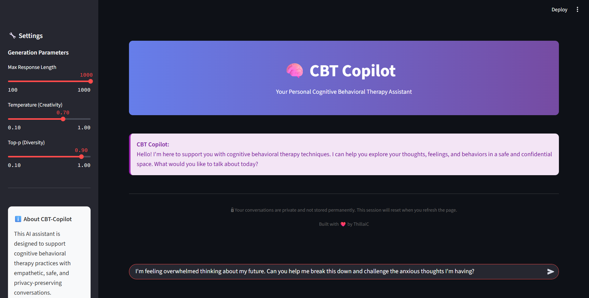
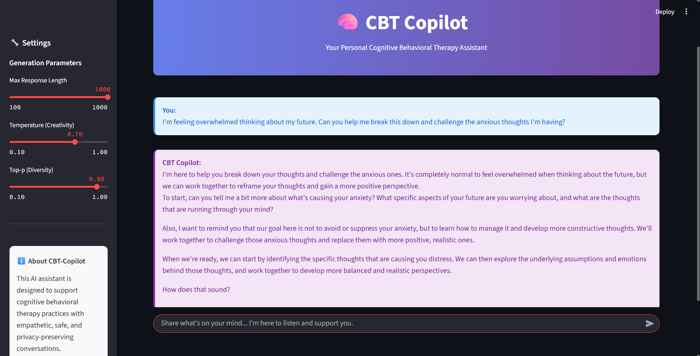

# CBT-Copilot 🧠💬

[](https://huggingface.co/thillaic/CBT-Copilot)
[](https://opensource.org/licenses/Apache-2.0)
[](https://www.python.org/)

**CBT-Copilot** is a fine-tuned version of `meta-llama/Llama-3.2-3B-Instruct`, specifically designed to simulate compassionate and supportive dialogues in the style of **Cognitive Behavioral Therapy (CBT)**. This model provides empathetic, structured therapeutic conversations while maintaining professional boundaries.

## 🎯 Model Overview

- **Base Model**: `meta-llama/Llama-3.2-3B-Instruct`
- **Fine-tuning Method**: LoRA (Low-Rank Adaptation)
- **Dataset**: `Lumiiree/therapod-dpo`
- **Model Size**: 3B parameters
- **Specialty**: Cognitive Behavioral Therapy conversations
- **Deployment**: Compatible with `transformers`, `vLLM`, and other inference frameworks

## 🚀 Quick Start

### Installation

```bash
pip install transformers torch accelerate
```

### Basic Usage

```python
from transformers import AutoTokenizer, AutoModelForCausalLM
import torch

# Load model and tokenizer
model_name = "thillaic/CBT-Copilot"
tokenizer = AutoTokenizer.from_pretrained(model_name)
model = AutoModelForCausalLM.from_pretrained(
    model_name,
    torch_dtype=torch.float16,
    device_map="auto"
)

# Generate response
def generate_cbt_response(prompt, max_length=512):
    inputs = tokenizer.encode(prompt, return_tensors="pt")
    
    with torch.no_grad():
        outputs = model.generate(
            inputs,
            max_length=max_length,
            temperature=0.7,
            do_sample=True,
            pad_token_id=tokenizer.eos_token_id
        )
    
    response = tokenizer.decode(outputs[0], skip_special_tokens=True)
    return response[len(prompt):].strip()

# Example usage
prompt = "I've been feeling overwhelmed with work lately and can't seem to manage my stress."
response = generate_cbt_response(prompt)
print(response)
```

### Web Interface with Streamlit

For an interactive web interface, you can use the included Streamlit app:

```bash
# Install additional dependencies
pip install streamlit

# Run the web interface
streamlit run app.py
```

This will launch a user-friendly web interface where you can have conversations with CBT-Copilot through your browser.

**Screenshot – Example Question:**



**Screenshot – Example Response:**



### Using with vLLM (Recommended for Production)

```python
from vllm import LLM, SamplingParams

# Initialize the model
llm = LLM(model="thillaic/CBT-Copilot")

# Set sampling parameters
sampling_params = SamplingParams(
    temperature=0.7,
    top_p=0.9,
    max_tokens=512
)

# Generate responses
prompts = ["I'm struggling with negative thoughts about myself."]
outputs = llm.generate(prompts, sampling_params)

for output in outputs:
    print(output.outputs[0].text)
```

## 📋 Model Details

### Training Configuration

The model was fine-tuned using the following configuration:

- **LoRA Parameters**:
  - `r=8`
  - `lora_alpha=16`
  - `target_modules=["q_proj", "v_proj"]`
  - `lora_dropout=0.05`

- **Training Parameters**:
  - `learning_rate=2e-5`
  - `batch_size=1` (with gradient accumulation)
  - `epochs=1`
  - `optimizer=paged_adamw_8bit`

### Dataset

Fine-tuned on the `Lumiiree/therapod-dpo` dataset, which contains high-quality therapeutic conversation examples structured for CBT-style interactions.

## 🎭 Use Cases

- **Mental Health Support**: Provide initial emotional support and coping strategies
- **Educational Tool**: Demonstrate CBT techniques and therapeutic communication
- **Research**: Study therapeutic dialogue patterns and intervention strategies
- **Training**: Help train mental health professionals in CBT communication styles

## ⚠️ Important Disclaimers

> **🚨 This model is for educational and research purposes only. It is NOT a replacement for professional mental health treatment.**

- This AI model cannot provide clinical diagnosis or treatment
- For serious mental health concerns, please consult licensed mental health professionals
- The model's responses should be used as supplementary support, not primary treatment
- Always prioritize professional medical advice for mental health issues

## 📊 Performance & Evaluation

The model demonstrates strong performance in:
- Empathetic response generation
- CBT technique application
- Maintaining therapeutic boundaries
- Providing structured support

*Detailed evaluation metrics and benchmarks will be added as they become available.*

## 🛠️ Fine-tuning Your Own Version

If you want to fine-tune this model further or create your own version:

```bash
# Clone this repository
git clone https://github.com/yourusername/CBT-Copilot
cd CBT-Copilot

# Install dependencies
pip install transformers accelerate peft trl datasets bitsandbytes

# Run fine-tuning
python model_finetuning.py
```

See `model_finetuning.py` for the complete training script.

## 📈 Deployment Options

### Local Deployment
- Use `transformers` library for small-scale applications
- Compatible with consumer GPUs (8GB+ VRAM recommended)

### Production Deployment
- **vLLM**: Recommended for high-throughput serving
- **Text Generation Inference**: Hugging Face's production-ready solution
- **Ollama**: For local, user-friendly deployment

### Cloud Deployment
- Deploy on Hugging Face Inference Endpoints
- Compatible with AWS SageMaker, Google Cloud AI Platform
- Docker containers available for scalable deployment

## 🤝 Contributing

We welcome contributions! Please feel free to:
- Report bugs and issues
- Suggest improvements
- Submit pull requests
- Share evaluation results

## 📜 License

This project is licensed under the Apache License 2.0 - see the [LICENSE](LICENSE) file for details.

## 🙏 Acknowledgments

- **Meta AI** for the base Llama 3.2 model
- **Lumiiree** for the therapod-dpo dataset
- The open-source community for tools and libraries used in this project


---

*Built with ❤️ for the mental health and AI communities*
